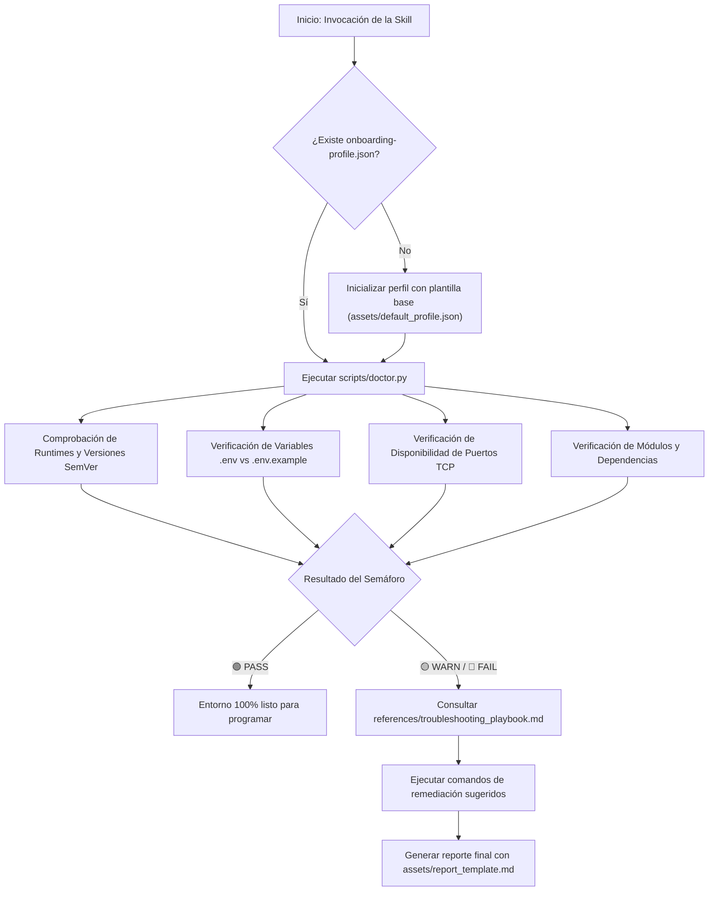

# Developer Onboarding Doctor

Esta habilidad proporciona un flujo automatizado de diagnóstico, verificación y resolución guiada de problemas en entornos de desarrollo local para nuevos integrantes del equipo o al clonar repositorios.

---

## Cuándo Utilizar esta Skill

- **Al iniciar un nuevo proyecto:** Para verificar si tu máquina local tiene instaladas las herramientas, CLIs y versiones de runtime requeridas.
- **Ante fallos de arranque (`npm run dev`, `docker compose up`):** Para diagnosticar si hay colisiones de puertos (ej: 3000, 5432 o 8080 ya ocupados por otros procesos) o si faltan dependencias compiladas.
- **Errores de variables de entorno:** Cuando la aplicación arroja `undefined` en credenciales o cuando falta el archivo `.env` respecto a `.env.example`.
- **Generación de reportes de Onboarding:** Para documentar el estado del entorno en formato Markdown (`ONBOARDING_DIAGNOSIS.md`).

---

## Flujo de Trabajo Paso a Paso



### Paso 1: Localización del Perfil de Requisitos
El proyecto objetivo debe contar con un archivo `onboarding-profile.json` en su raíz.
Si el proyecto no lo tiene aún, inicialízalo con el comando:
```bash
python3 .agents/skills/developer-onboarding-doctor/scripts/doctor.py --project <RUTA_PROYECTO> --init
```
Este comando utiliza la plantilla base localizada en [`assets/default_profile.json`](./assets/default_profile.json) y el esquema formal de validación [`assets/project_profile_schema.json`](./assets/project_profile_schema.json).

### Paso 2: Ejecución del Diagnóstico
Ejecuta el script de diagnóstico para evaluar la máquina local:
```bash
python3 .agents/skills/developer-onboarding-doctor/scripts/doctor.py --project <RUTA_PROYECTO>
```

Para generar simultáneamente un informe Markdown para el repositorio:
```bash
python3 .agents/skills/developer-onboarding-doctor/scripts/doctor.py --project <RUTA_PROYECTO> --report <RUTA_PROYECTO>/ONBOARDING_DIAGNOSIS.md
```

### Paso 3: Interpretación del Semáforo
- 🟢 **TODO LISTO (PASS):** Todos los runtimes, CLIs, puertos y dependencias están en orden. El desarrollador puede proceder a levantar la aplicación.
- 🟡 **ADVERTENCIAS (WARN):** Existen elementos opcionales ausentes (variables no críticas o puertos secundarios tomados).
- 🔴 **ACCIONES BLOQUEANTES (FAIL):** Algún requisito indispensable está ausente (ej. Node no instalado, versión inferior a la requerida, puerto principal tomado o `.env` ausente).

### Paso 4: Remediación Guiada
Si se detectan problemas, aplica las soluciones sugeridas en la salida o consulta el manual completo en:
[`references/troubleshooting_playbook.md`](./references/troubleshooting_playbook.md)

Para solucionar rápidamente un `.env` faltante a partir de `.env.example`:
```bash
python3 .agents/skills/developer-onboarding-doctor/scripts/doctor.py --project <RUTA_PROYECTO> --fix-env
```

Para consultar los estándares y mejores prácticas de arquitectura de entornos:
[`references/environment_standards.md`](./references/environment_standards.md)
